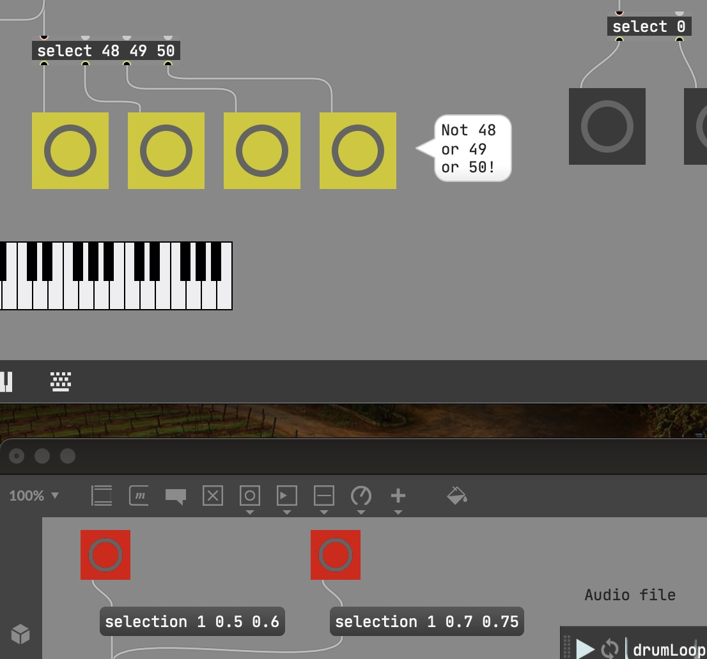

# Slide 1

---

# Slide 2a

``` javascript
const A = x => ({B: x})
```

And we're out of the code again and into paragraphs.

--

# Slide 2b

A little bit of inline styling, <span style="color: red">like so</span>.

(Better to wheel in some CSS via `index.html` I guess.)

---

# Slide 3

Testing inline formatting for Max/MSP slides: this is a Max <span class="max-obj">object</span>,
this is a <span class="max-msg">message</span>.

---

# Slide 4x

Image test:

<div class="image-h-400">



</div>

---

# Slide 5

Smartypants typographic "processing" should be working---or should it?

X---X--X---X's
